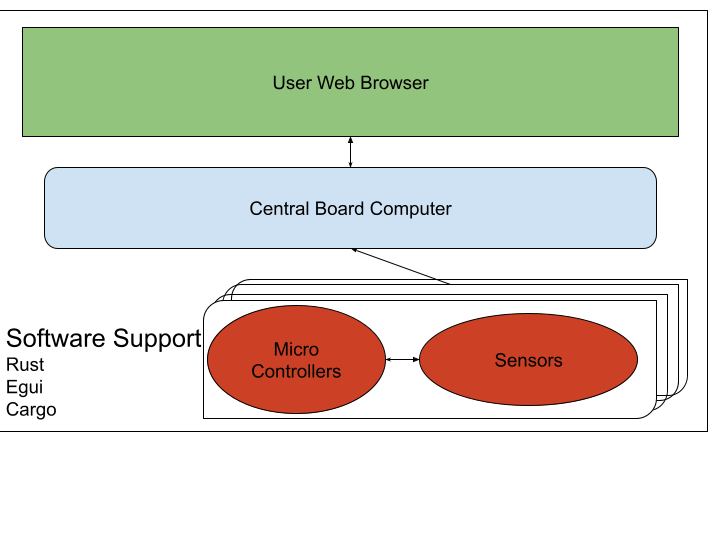

# Software Design and Architecture Document (SDA)

**Authors:** Jake Goodwin, Aidan Agee, Blake Babb, Patrick Iacob

**DATE:** 2023-12-03

## Introduction

This document establishes the software and hardware architecture for a personal data acquisition system. Selecting the correct architecture improves development velocity and enables more robust functionality by having systems that support each other. Cohesive Software Architecture is particularly important for this project as our workflow has contributers split into two subteams which are developing a frontend and backend that must communicate. In addition to that, designing an appropriate hardware architecture will reduce development costs and help our product find its place in the market.

## Architectural Goals and Principles

Our hardware and software architectures have the primary goal of being synergistic with each other and possesing libraries that interface with each other. Because our project covers layers ranging from hardware to a website, connection throughout the stack is critical. Additionally, as we work through the prototyping stage our architecture will practice modularity to be able to add new sensor hardware as we expand the capabilities of the product. Our architecture does not need to priotizie scalability as the final objective is only to develop a prototype. 

## System Overview

## Architectural Patterns

Controller Responder: This pattern is useful as our hardware SBC can act as the controller which has a single responder in the user webpage. This pattern would help cache data generated by the controller to provide a seamless experience to the user in the face of latency issues. Additionally, the ability to access data in the responder without affecting the controller will allow for computation in an environment separate from the hardware board.

Event Sourcing: This pattern works especially well with realtime data, which is what this project is all about. Our hardware controller can act as the producer and broadcast its data to a web server which will act as the event source for any users that want to query the server and consume that data. The fail-safety of this design is also important to this project as data acquisition environments, such as racing or aeronautics, often cause damage to the controller while still requiring data to be accessible.

## Component Descriptions

Sensors: Hardware components that acquire the raw data, such as accelerometers or GPS devices.

Microcontroller: Small computer that is responsible for coordinating the sensors and collecting their data to be broadcast to the web server.

Web server: Acts as the intermediary between the user and the physical acquisition device. Communicates with the board, composed of the microcontroller and its sensors, to collect data which it then relays to the user interface when queried.

User interface: An HTTP webpage that requests data from the web server to present in useful ways to the user.

## Data Management

## Interface Definitions

There will be a user interface to collect data from each sensor and display it to the user. There will be interactions to get event logs from each sensor, and to clear the event logs.
The user interface will be hosted on a web server, which users will connect to over with their browser over HTTP. 
The endpoints for the interface main page would just be the address, with `[address]/config` to configure sensors.

## Considerations

### Security

The primary data security risk in this project is data loss due to physical conditions of the board. This includes both permanent damage through the elements or impacts as well as location preventing broadcast to the web server. A caching system on both the board and in the web server is the approach that will be used to mitigate this risk.

The data security risks due to bad actors in this project are minimal as the data being processed is kinematic information. Regardless, our web server will require password authentication to access the RSA encrypted data.

### Performance

There are two primary performance concerns of the product. The first is the resolution of our data and how quickly we can poll our sensors, for which the current target is acquiring 10 data points per second. We plan to achieve this metric by screening hardware before they are implemented into the design to ensure it can meet this desired performance. The second concern is with the stability of the connection between the user interface and the board’s raw data. We plan to create a web server that will be able to cache the data produced by the board and present to the user at will to mitigate this concern. 

### Maintenance and Support

Once the prototype is complete maintenance and development will be inherited by Patton Dynamics, the company partner for this project. The company has a background in aeronautics, competitive motor racing, and computer assisted physics, all of which are relevant to the project area. Their experience with the common end users of personal data acquisition devices makes them very capable of supporting users through the lifecycle of the product.

## Deployment Strategy

## Testing Strategy

## Glossary

* SBC: Single Board Computer
